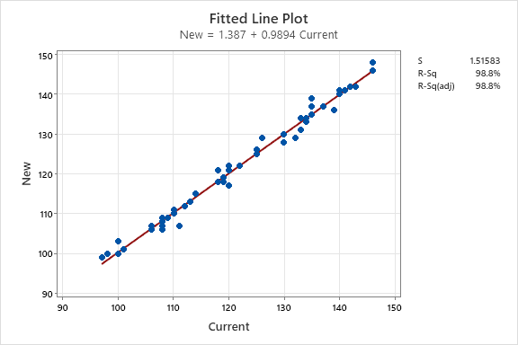

# 이차함수의 성질을 이용한 선형회귀를 통한 미래 월세 가격 예측

10134 정채건

---

## 탐구 동기 
교내 학급특색 활동에서 합리적 선택을 통해 자신에게 알맞은
주거 환경을 찾는 활동을 하였다. 합리적 선택을 하기 위해서는 비용과 편익을
 정확하게 계산하는 과정이 필요한데 10년 후의 미래를 예측하는 것이기 때문에
 현재 월게 가격을 보는 것만으로는 미래의 비용을 계산하는 데에 어려움을 겪었다.
 따라서 미래의 월세 가격을 예측하여 미래의 합리적 선택에 기여하기 위해 위
 탐구를 진행하였다.

## 이론적 배경

- 이차함수의 최대, 최소
 
이차함수 f(x) = ax^2 + bx + c (a != 0)는 축 x = -b/2a 에서
a > 0일 경우 최솟값, a < 0일 경우 최댓값을 갖는다.

- 단순선형회귀
 
단순선형회귀는 한 변수와 또 다른 변수의 크기 사이에 어떤 관계, 
예를 들면 X가 증가하면 Y가 감소하는 식의 관계를 제공한다. 선형회귀에서는
 직선을 이용하여 변수 X로부터 변수 Y를 예측한다.
 
Y = W * X + b

 
b는 절편(상수)를 뜻하고, W는 X의 기울기를 뜻한다.
 
오차는 원래 값에서 예측한 값을 빼서 구할 수 있고, 각각의 데이터에 대한
 오차를 제곱하여 더한 값을 오차제곱합(RSS)라 한다. 선형회귀는 RSS가 최소가 되게 하는
 기울기와 절편을 찾는 것을 목표로 한다.

  
## 탐구 과정

### 데이터 전처리

- 공공데이터포털의 '한국부동산원_오피스텔 가격동향조사_월세가격(지역별).csv'
파일을 이용
- 데이터에서 평균 월세 가격이 포함되어 있는 열만 추출
- 2020년 7월을 기준으로 0부터 1씩 증가하는 숫자로 열을 변환
- 각각의 지역별 데이터를 numpy 배열로 변환하고 서울, 경기도, 부산의 데이터를 저장함
### 선형회귀 라이브러리 제작

- 선형회귀에서 기울기와 절편의 정보를 담고 있는 Coefficient 클래스 제작
- 선형회귀를 사용할 수 있는 LinearRegerssion 클래스 제작
- Linear 클래스는 입력 데이터와 정답 데이터를 받아 선언됨
