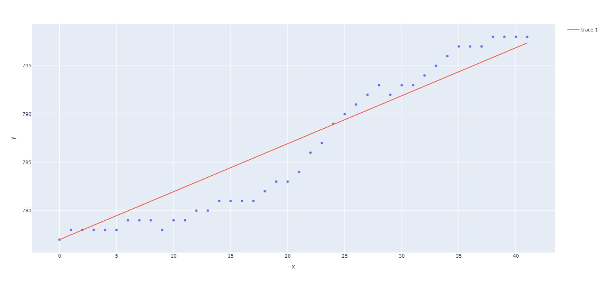
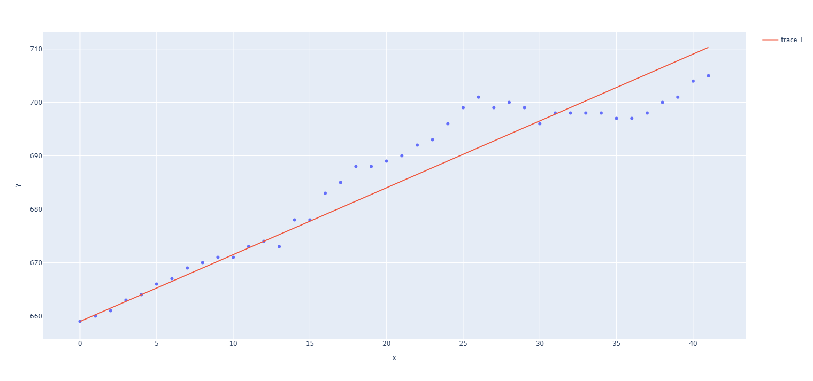
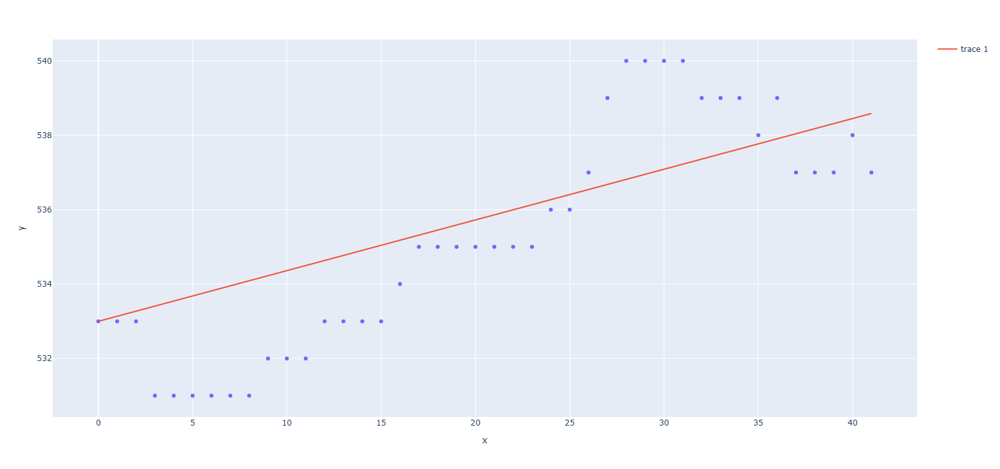

# 이차함수의 성질을 이용한 선형회귀를 통한 미래 월세 가격 예측

작성자: 10134 정채건

---

## 탐구 동기 
교내 학급특색 활동에서 합리적 선택을 통해 자신에게 알맞은
주거 환경을 찾는 활동을 하였다. 합리적 선택을 하기 위해서는 비용과 편익을
 정확하게 계산하는 과정이 필요한데 10년 후의 미래를 예측하는 것이기 때문에
 현재 월게 가격을 보는 것만으로는 미래의 비용을 계산하는 데에 어려움을 겪었다.
 따라서 미래의 월세 가격을 예측하여 미래의 합리적 선택에 기여하기 위해 위
 탐구를 진행하였다.
<hr>

## 이론적 배경

- 이차함수의 최대, 최소
<br>
이차함수 f(x) = ax^2 + bx + c (a != 0)는 축 x = -b/2a 에서
a > 0일 경우 최솟값, a < 0일 경우 최댓값을 갖는다.
<br>

- 단순선형회귀
<br>
단순선형회귀는 한 변수와 또 다른 변수의 크기 사이에 어떤 관계, 
예를 들면 X가 증가하면 Y가 감소하는 식의 관계를 제공한다. 선형회귀에서는
 직선을 이용하여 변수 X로부터 변수 Y를 예측한다.
<br>
Y = W * X + b


<br>
b는 절편(상수)를 뜻하고, W는 X의 기울기를 뜻한다.
<br>
오차는 원래 값에서 예측한 값을 빼서 구할 수 있고, 각각의 데이터에 대한
 오차를 제곱하여 더한 값을 오차제곱합(RSS)라 한다. 선형회귀는 RSS가 최소가 되게 하는
 기울기와 절편을 찾는 것을 목표로 한다.

  
## 탐구 과정

### 데이터 전처리

- 공공데이터포털의 '한국부동산원_오피스텔 가격동향조사_월세가격(지역별).csv'
파일을 이용
- 데이터에서 평균 월세 가격이 포함되어 있는 열만 추출
- 2020년 7월을 기준으로 0부터 1씩 증가하는 숫자로 열을 변환
- 각각의 지역별 데이터를 numpy 배열로 변환하고 서울, 경기도, 부산의 데이터를 저장함

```python
'''
src/index.py
'''

import numpy as np
import pandas as pd
import src.statistics.linear as linear

# 데이터를 불러오기
data = pd.read_csv("data.csv", encoding="cp949")

# 평균월세를 추출하여 시작 달을 0으로 변경(기준: 2020년 7월)
data = data.filter(regex="지역|평균월세가격")
data.set_index("지역", inplace=True)
data.columns = [i for i in range(len(data.columns))]
data_array = data.to_numpy()

# 서울, 경기도, 부산 추출
X = np.arange(len(data.columns))
seoul_data = data_array[3]
gyeongy_data = data_array[16]
busan_data = data_array[9]
```

### RSS 최솟값 구하기
- 오차제곱합을 계산하면 기울기(W)와 절편(b)을 미지수로 갖는 이차식이 나옴
- 이때 절편을 고정하면 W를 미지수로 갖는 이차식 f(W)가 나옴
- 입력 데이터를 X, 출력 정답 데이터를 Y, 배열 P의 값들의 합을 S(P)라 하자
- f(W)는 이차항의 계수가 S(X^2), 일차항의 계수가 2 * (b * S(X) - X * Y)임
- X의 값들이 실수이므로 S(X^2)는 양수 값을 가짐
- 따라서 f(W)는 (X * Y - b * S(X)) / S(X^2)에서 최솟값을 가짐

### 선형회귀 라이브러리 제작

- 선형회귀에서 기울기와 절편의 정보를 담고 있는 Coefficient 클래스 제작
- 선형회귀를 사용할 수 있는 LinearRegerssion 클래스 제작
- Linear 클래스는 입력 데이터와 정답 데이터를 받아 선언됨
- Linear 클래스는 값 예상, 손실 함수(오차제곱합) 계산, 손실 함수의 최솟값 계산, 그래프를 그리는 기능을 담음

```python
'''
src/statistics/linear.py
'''

import numpy as np
import plotly.express as px


class Coefficient:
    """
    선형회귀에서 기울기와 절편의 정보를 담고 있는 클래스
    """
    def __init__(self, W, b):
        """
        객체 선언 시 실행되는 메서드
        :param W: 선형회귀에서의 기울기
        :param b: 선형회귀에서의 절편
        """
        self.W = W
        self.b = b

    def __repr__(self):
        """
        객체를 출력 시 실행되는 메서드
        :return: 객체 형식으로 출력. 각각 기울기와 절편을 나타냄
        """
        return f'Coefficient({self.W}, {self.b})'

    def predict(self, x):
        return self.W * x + self.b


class LinearRegression:
    """
    단순선형회귀를 위한 클래스
    """
    def __init__(self, input_data: np.ndarray, output_data: np.ndarray):
        """
        객체 선언 시 실행되는 메서드
        :param input_data: 입력 데이터
        :param output_data: 출력 정답 데이터
        """
        self.input_data = input_data
        self.output_data = output_data

    def prediction(self, coefficient: Coefficient):
        """
        예상되는 값을 반환하는 메서드
        :param coefficient: 예측 시 사용될 기울기와 절편이 포함된 Coefficient 객체
        :return: 예상 값을 numpy 배열로 반환
        """
        y_hat = coefficient.W * self.input_data + coefficient.b
        return y_hat

    def rss(self, coefficient: Coefficient):
        """
        계수(Coefficient 객체)에 따라 오차제곱합(RSS)를 반환하는 메서드
        :param coefficient: 사용될 Coefficient 객체
        :return: 계수에 따라 RSS 값을 반환
        """
        y_hat = self.prediction(coefficient)
        rss = np.sum((y_hat - self.output_data) ** 2)
        return rss

    def find_min(self):
        """
        절편을 첫째 값으로 고정하고 RSS가 최소가 되게 하는 기울기를 찾는 메서드
        :return: 기울기가 최소가 되게 하는 Coefficient 객체
        """
        result = Coefficient(0, self.output_data[0])
        b = result.b
        result.W = (np.sum(self.input_data * self.output_data) - b * np.sum(self.input_data)) / np.sum(
            self.input_data ** 2)

        return result

    def draw_scatter(self):
        """
        객체의 입력 데이터와 출력 데이터에 따라 산점도를 그리는 메서드
        :return: 반환하지 않음
        """
        fig = px.scatter(x=self.input_data, y=self.output_data)
        fig.show()

    def draw_line(self, coefficient: Coefficient):
        """
        산점도와 선형 회귀시 만들어지는 직선을 그리는 메서드
        :param coefficient: 사용된 Coefficient 객체
        :return: 반환하지 않음
        """
        fig = px.scatter(x=self.input_data, y=self.output_data)
        fig.add_scatter(x=self.input_data, y=self.prediction(coefficient))
        fig.show()

```

### 데이터 분석

- 초기 기울기와 절편을 모두 0으로 설정
- 위 경우의 손실 함수를 계산
- find_min 메서드를 이용하여 RSS가 최소가 되게 하는 기울기 찾기
- 학습 전 RSS와 학습 후 RSS 비교

```python
'''
src/index.py
'''

# 서울 데이터 추측
print('---------------서울 데이터 추측----------------------')
seoul_coefficient = linear.Coefficient(0, 0)
seoul_linear = linear.LinearRegression(X, seoul_data)
seoul_result = seoul_linear.find_min()
print(f'학습 후 가중치, 편향: {seoul_result}')
print(f'초기 RSS: {seoul_linear.rss(seoul_coefficient)}')
print(f'학습 후 RSS: {seoul_linear.rss(seoul_result)}')
seoul_linear.draw_line(seoul_result)

# 경기 데이터 추측
print('---------------경기 데이터 추측----------------------')
gyeongy_coefficient = linear.Coefficient(0, 0)
gyeongy_linear = linear.LinearRegression(X, gyeongy_data)
gyeongy_result = gyeongy_linear.find_min()
print(f'학습 후 가중치, 편향: {gyeongy_result}')
print(f'초기 RSS: {gyeongy_linear.rss(gyeongy_coefficient)}')
print(f'학습 후 RSS: {gyeongy_linear.rss(gyeongy_result)}')
gyeongy_linear.draw_line(gyeongy_result)

# 부산 데이터 추측
print('---------------부산 데이터 추측----------------------')
busan_coefficient = linear.Coefficient(0, 0)
busan_linear = linear.LinearRegression(X, busan_data)
busan_result = busan_linear.find_min()
print(f'학습 후 가중치, 편향: {busan_result}')
print(f'초기 RSS: {busan_linear.rss(busan_coefficient)}')
print(f'학습 후 RSS: {busan_linear.rss(busan_result)}')
busan_linear.draw_line(busan_result)

```

### 미래 가격에 따른 합리적 선택

- 서울, 경기, 부산의 집값을 예측하는 직선 찾기
- 내가 20세일 때와 2020년 7월이 차이나는 달수 구하기
- 각각의 직선에 대입하여 미래의 가격 예측
```python
'''
src/index.py
'''

# 2027년 3월의 월세 예측
delta_month = 12 * 7 - 4
for result in [seoul_result, gyeongy_result, busan_result]:
    print(result.predict(delta_month))

```
- 비용과 편익을 구하고 합리적 선택 하기


## 탐구 결과

### 선형 회귀 결과
<hr>

```
---------------서울 데이터 추측----------------------
학습 후 가중치, 편향: Coefficient(0.4967465681541497, 777)
초기 RSS: 25978102
학습 후 RSS: 221.9978590319453

---------------경기 데이터 추측----------------------
학습 후 가중치, 편향: Coefficient(1.2510809789681374, 659)
초기 RSS: 19742209
학습 후 RSS: 824.2846647915716

---------------부산 데이터 추측----------------------
학습 후 가중치, 편향: Coefficient(0.13618236010243062, 533)
초기 RSS: 12032522
학습 후 RSS: 138.22442382771442
```

서울 평균 월세 선형 회귀


경기도 평균 월세 선형 회귀


부산 평균 월세 선형 회귀
<hr>
세 경우 모두 학습 전 RSS보다 학습 후의 RSS가 더 작아졌으며 부산의 기울기가 약 0.14로 가장 작았음. 이는 월세의 상승률이 부산에서 가장 작다는 것을 의미함. 
또한 경기도에서의 학습 후 RSS가 가장 큰 것으로 보아 경기도의 데이터가 가장 선형적이지 않다는 것을 알 수 있다.

### 미래 가격 예측

학습 후 얻은 Coefficient 객체의 predict 메서드를 이용하여 미래의 월세를 예측히면
```
서울: 816.739725452332만원      약 817만원
경기: 759.086478317451만원      약 759만원
부산: 543.8945888081945만원     약 544만원
```
이 나온다. 교통, 환경 등의 조건을 고려하지 않고 개인적 만족감을 서울, 경기, 부산에서 각각 1000만원, 900만원, 700만원으로 정하면 다음과 같이 정리할 수 있다.

|    | 편익   | 명시적 비용 | 가치  | 암묵적 비용 | 기회비용 | 
|----|------|--------|-----|--------|------|
| 서울 | 1000 | 817    | 183 | 156    | 973  |
| 경기 | 900  | 759    | 141 | 183    | 842  |
| 부산 | 700  | 544    | 156 | 183    | 727  |

위 표에서 서울에서 편익이 기회비용보다 크므로 서울에서 집을 구하는 것이 합리적이라는 것을 알 수 있다. 하지만 서울에서의 월세 상승률이 부산에서 더 크므로 장기 거주할 경우 부산에서 거주하는 것이 더 합리적일 수 있다.

## 결론
### 알게 된 점
이번 탐구를 통해 단순선형회귀와 이차함수의 성질을 활용하여 미래의 월세 가격을 예측할 수 있음을 확인했다. 서울, 경기, 부산의 월세 데이터를 이용해 시간에 따른 월세 상승률을 계산하고, 이를 바탕으로 7년 후 월세 가격을 추정했다. 특히 각 지역의 월세 상승률을 통해 월세 상승이 가장 적은 지역과 많은 지역을 구분할 수 있었고, 편익과 비용을 비교 분석하여 가장 합리적인 선택이 서울임을 확인했다.

단순선형회귀를 통해 얻은 기울기와 절편을 바탕으로 미래 월세를 예측한 결과, 예측한 가격에 기초한 분석을 통해 월세 상승률이 상대적으로 낮은 지역에 거주하는 것이 경제적으로 유리할 수 있다는 사실도 얻을 수 있었다.


### 보완할 점

- 손실 함수의 최솟값을 찾는 과정에서 절편을 고정시키고 기울기만 조정함. 따라서 완벽한 최솟값을 찾지는 못함. 따라서 변수가 두 개인 식에서 최솟값을 찾는 방법을 탐구해볼 것임
- 월세 예측을 여러 요소를 고려한 것이 아니라 단순히 시간에 따른 변화만 살펴봄. 따라서 월세 가격에 영향을 미칠 수 있는 여러 요인들을 찾아 보다 적절한 예측을 할 것임.
- 편익과 비용을 구하는 과정에서 개인적 만족감만 고려함. 편익과 비용에 영향을 미치는 다른 요인도 분석하여 보다 더 합리적인 선택을 할 것임.


## 참고 자료

- 데이터 과학을 위한 통계 - 피터 브루스
- 소스 코드: https://github.com/Sinclair42/costPrediction
